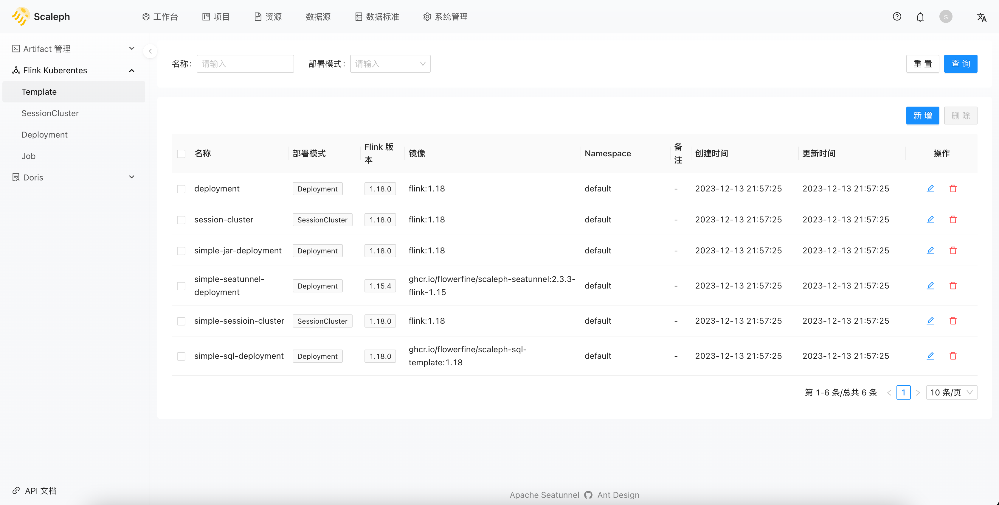
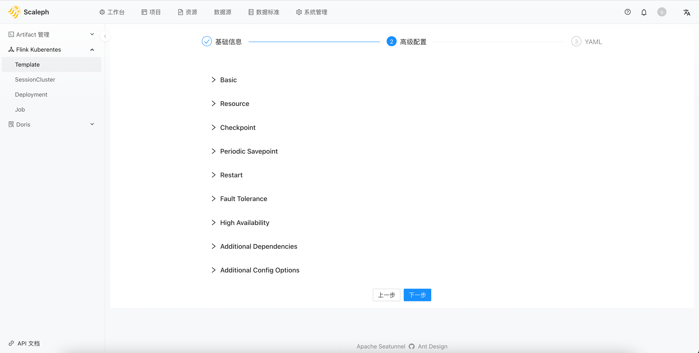
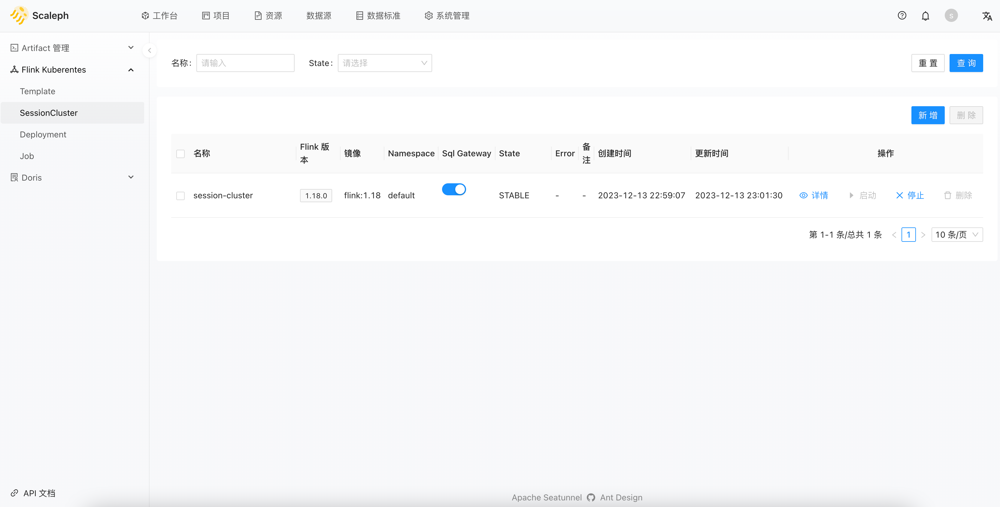
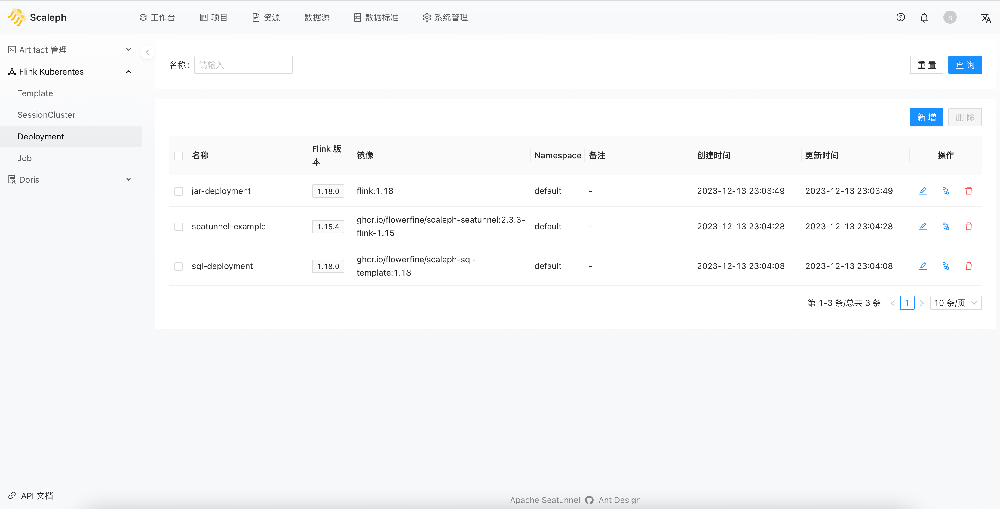

# Flink Kubernetes

`scaleph` 基于 [Flink Kubernetes Operator](https://nightlies.apache.org/flink/flink-kubernetes-operator-docs-stable/) 实现 Flink 在 Kubernetes 上运行。

在 `scaleph` 中相关页面遵循 `Template` -> `Session Cluster`、`Deployment` -> `Job` 使用流程。

## Template

测试、验证环境和生产环境有着不一样的要求，在生产环境中稳定运行 Flink 任务不是一件容易的事情，Flink 也提供相应的 [生产就绪检查列表](https://nightlies.apache.org/flink/flink-docs-release-1.18/docs/ops/production_ready/) 帮助用户避免生产故障。

用户可以在 `项目` -> `Flink Kubernetes` -> `Template` 中，创建或修改模板。

`scaleph` 在模板中提供了一个详尽的配置信息页面，辅助用户预配置生产环境 Flink 任务运行至关重要的配置：

* checkpoint。checkpoint 策略如频率，超时时间等。
* savepoint。Flink Kubernetes Operator 提供的周期性 savepoint 功能。
* 容灾
  * 任务级。重启策略。
  * JobManager。HA 配置。
  * 集群重启。Flink Kubernetes Operator 提供的集群整个重启功能。

## Session Cluster

`项目` -> `Flink Kubernetes` -> `SessionCluster` 代表 Flink 支持的 session 模式，用户可以这里创建一个 session cluster。

创建 session cluster 时，用户需指定 `Template` 和 `Cluster`：

* `Template`。通过提前定义好的模板，用户可以快速应用大量预定义的配置到 session cluster 中
* `Cluster`。Kubernetes 集群，指定待部署的 Kubernetes 集群。用户需在 `资源` -> `Cluster Credential` 中提前上传

`SessionCluster` 页面还有个 `Sql Gateway` 的启用关闭按钮，每个项目只可以启动一个 `Sql Gateway` 服务，用户可以创建多个 session cluster，但只能在一个 session cluster 启动 `Sql Gateway`。启用 `Sql Gateway` 后，后续在 `项目` -> `Artifact 管理` -> `SQL` -> 在线 Flink SQL 编辑器中运行 Flink SQL 任务。

## Deployment

与 `SessionCluster` 类似，`项目` -> `Flink Kubernetes` -> `SessionCluster` 代表 Flink 支持的 application 模式。用户创建 `Deployment` 后，稍后可在 `项目` -> `Flink Kubernetes` -> `Job` 应用 `Deployment`。 

`Deployment` 不可直接启动。

## Job

`Job` 部分支持 3 种任务类型，分别是：

* Jar
* SQL
* SeaTunnel。Flink 引擎

