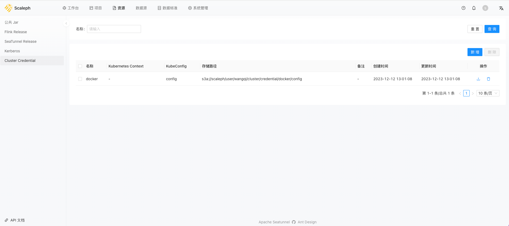
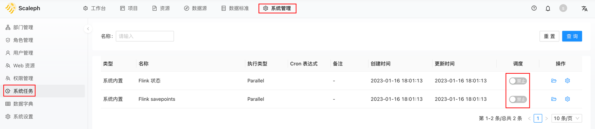

# 系统初始化

`scaleph` 部署成功后，通过 `sys_admin/123456` 登录 [http://localhost:8096](http://localhost:8096) 后，系统维护者或者管理员需要先行对系统进行初始化，填充用户进行数据开发的必需配置和文件。

## 资源上传

使用 `scaleph` 系统前需上传 `scaleph` 系统运行必需的资源。

### Cluster Credential

`scaleph` 支持多集群部署，即用户可以将 Flink 或 SeaTunnel 任务部署至多个 Kubernetes 集群。

用户需上传 Kubernetes 集群 kubeconfig 文件，kubeconfig 文件，一般位于 `$HOME/.kube/config`。帮助 `scaleph` 连接对应的集群，通过相应的权限验证以提交任务到对应的集群。

从 `资源` -> `Cluster Credential` -> `新增`进入上传页面：

上传成功：

## 启动调度

`scaleph` 应用本身运行需要定时任务：

* 同步提交的 Flink 任务状态和 checkpoint 数据。

应用部署好后，需启动 `scaleph` 系统调度任务。从 `系统管理` -> `系统任务` 进入启动页面：

