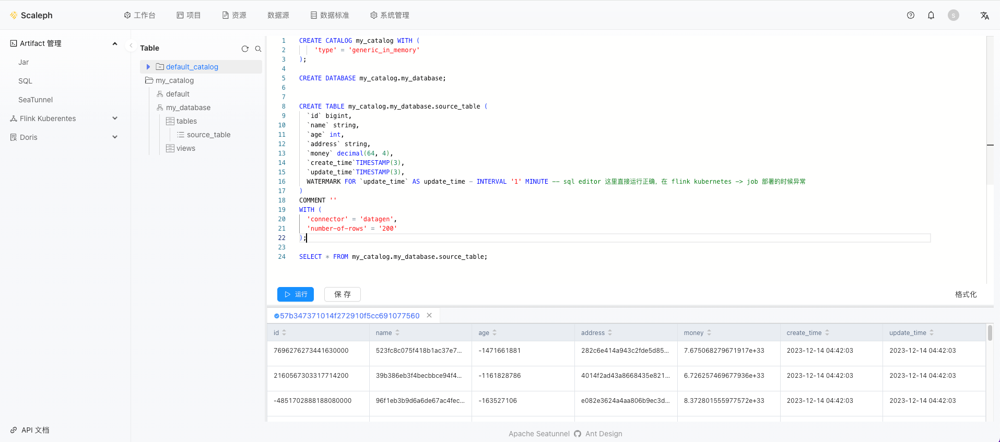
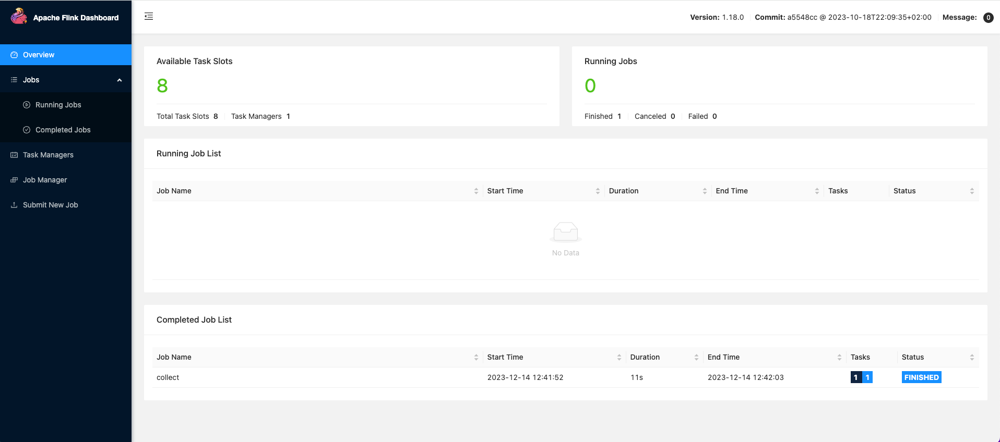

# SQL

`scaleph` 对接了 [SQL Gateway](https://nightlies.apache.org/flink/flink-docs-release-1.18/docs/dev/table/sql-gateway/overview/) 提供了 Flink SQL online 编辑器，用户可以在线开发、调试 Flink SQL 任务。

任务上线时，用户需在 `项目` -> `Flink Kubernetes` -> `Job` 部署 SQL 任务。

## SQL 开发

在 `项目` -> `Artifact 管理` -> `SQL` 可以进入 Flink SQL online 编辑器，在线开发 SQL 任务，Flink SQL online 编辑器增加了 Flink [Catalogs](https://nightlies.apache.org/flink/flink-docs-release-1.18/docs/dev/table/catalogs/) 支持。

挨个选中、运行 DDL 语句，创建 catalog、database 和 table：

在执行过一系列 DDL 后，可以在侧边栏看到对应的 database 和 tables：

选中 select 语句，点击 `运行`，稍等片刻即可看到执行结果：

同时可以在 Flink web-ui 查看任务：

