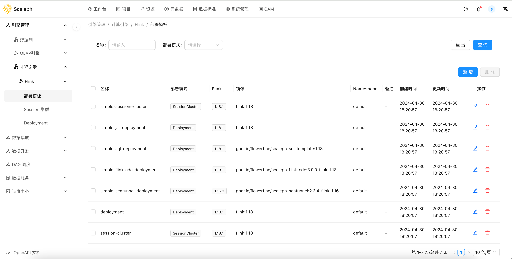
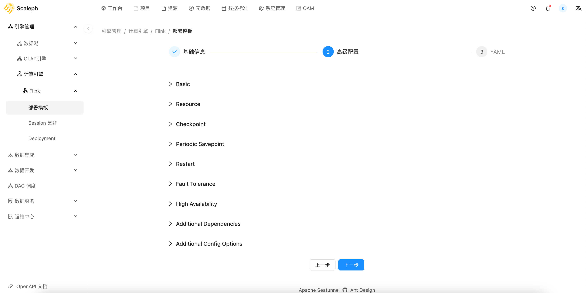
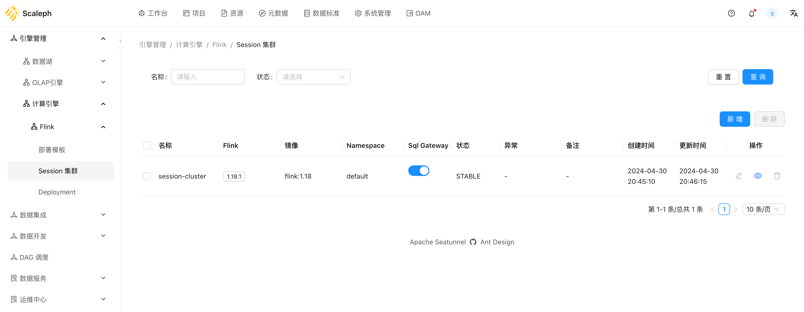
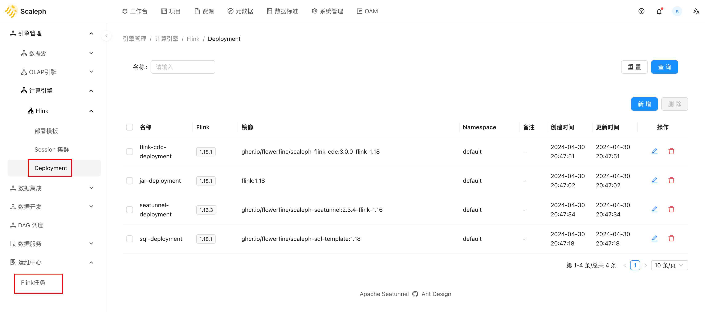

# Flink Kubernetes

`scaleph` 基于 [Flink Kubernetes Operator](https://nightlies.apache.org/flink/flink-kubernetes-operator-docs-stable/) 实现 Flink 在 Kubernetes 上运行。

在 `scaleph` 中相关页面遵循 `Template` -> `Session Cluster`、`Deployment` -> `Job` 使用流程。

## 环境配置

Flink 支持与 YARN、Kubernetes 资源调度系统集成，实现资源的动态申请和释放，适应不同规模的数据任务。

Flink 作为有状态的流式计算引擎，状态存储、checkpoint 配置会直接影响数据的准确性，[High Availability](https://nightlies.apache.org/flink/flink-docs-release-1.15/docs/deployment/config/#high-availability) 和 [Fault Tolerance](https://nightlies.apache.org/flink/flink-docs-release-1.15/docs/deployment/config/#fault-tolerance) 保证异常出现时有任务足够的弹性容错，其余如日志、监控等可以让开发者了解任务运行细节，便于排查问题。

优秀的 Flink 商业云服务，通过整合 Kubernetes、存储、日志、Prometheus 等提供大量的 pre-defined decision，让用户得到开箱即用的 Serverless 开发体验，让用户无需关心 Flink 运维，集中精力关注业务开发。

像阿里云基于 VVR 引擎提供的 Flink 实时计算服务：

- 基于 ACK 提供容器资源。
- 基于 OSS 提供存储服务，用于存储 Jar、checkpoints 和 savepoints，High availability 数据等。
- 基于 SLS 日志服务，用户可以自定义 Flink 任务模板将日志输出到 SLS 日志服务中。
- 基于 SLB 负载均衡，用户可以直接查看 Flink 任务的 web ui。
- Prometheus 和 Grafana，Flink 实时计算服务需要开通额外的 Prometheus 服务用于 Flink 任务监控。

但是商业云服务也会存在大量的厂商绑定问题，以阿里云 Flink 实时计算服务为例：

- VVR 引擎相比开源 Flink 有一定的改变，VVR 的 connector 需使用与开源 Flink connector 兼容的 ververica connector，造成以 DataStream API 开发的任务在本地使用开源 Flink connector，实际运行时需切换到 VVR connector。
- 开通 Flink 实时计算服务，需额外开通额外的服务，如 OSS、Prometheus、SLB 等。如果企业是初次尝试使用阿里云云服务，采用 Flink 实时计算服务时会连带开通多项服务。

开源的 `scaleph` 在提供 Flink 服务时需考虑到用户多种多样的硬件和服务环境，难以如云厂商一样直接锚定某个解决方案，需提供兼容性，因此 `scaleph` 将核心配置项挑选出来，通过分步表单引导用户思考如何保障 Flink 任务稳定运行。

- [Checkpointing](https://nightlies.apache.org/flink/flink-docs-release-1.15/docs/deployment/config/#checkpointing)
- [Checkpoints and State Backends](https://nightlies.apache.org/flink/flink-docs-release-1.15/docs/deployment/config/#checkpoints-and-state-backends)
- [High Availability](https://nightlies.apache.org/flink/flink-docs-release-1.15/docs/deployment/config/#high-availability)
- [Fault Tolerance](https://nightlies.apache.org/flink/flink-docs-release-1.15/docs/deployment/config/#fault-tolerance)
- [Memory Configuration](https://nightlies.apache.org/flink/flink-docs-release-1.15/docs/deployment/config/#memory-configuration)
- [Execution](https://nightlies.apache.org/flink/flink-docs-release-1.15/docs/deployment/config/#execution)
- [Pipeline](https://nightlies.apache.org/flink/flink-docs-release-1.15/docs/deployment/config/#pipeline)
- [Metrics](https://nightlies.apache.org/flink/flink-docs-release-1.15/docs/deployment/config/#metrics)
- [JVM and Logging Options](https://nightlies.apache.org/flink/flink-docs-release-1.15/docs/deployment/config/#jvm-and-logging-options)

`scaleph` 从上述核心配置项中，提炼出的分步表单参数如下：

- State & Checkpoints & Savepoints
- Fault Tolerance
- High Availability
- Resource Configuration
- Additional Config Options

为了避免用户每次都需重复配置，`scaleph` 提供了集群配置模板功能，通过预设的模板，用户可以直接使用统一的配置，同时可以在任务级别，对配置模板进行调整。

## Template

用户可以在 `项目` -> `引擎管理` -> `计算引擎` -> `Flink` -> `部署模板` 中，创建或修改模板。

`scaleph` 在模板中提供了一个详尽的配置信息页面，辅助用户预配置生产环境 Flink 任务运行至关重要的配置：

* checkpoint。checkpoint 策略如频率，超时时间等。
* savepoint。Flink Kubernetes Operator 提供的周期性 savepoint 功能。
* 容灾
  * 任务级。重启策略。
  * JobManager。HA 配置。
  * 集群重启。Flink Kubernetes Operator 提供的集群整个重启功能。

## Session Cluster

`项目` -> `引擎管理` -> `计算引擎` -> `Flink` -> `Session 集群` 代表 Flink 支持的 session 模式，用户可以这里创建一个 session cluster。

创建 session cluster 时，用户需指定 `Template` 和 `Cluster`：

* `Template`。通过提前定义好的模板，用户可以快速应用大量预定义的配置到 session cluster 中
* `Cluster`。Kubernetes 集群，指定待部署的 Kubernetes 集群。用户需在 `资源` -> `Cluster Credential` 中提前上传

`SessionCluster` 页面还有个 `Sql Gateway` 的启用关闭按钮，每个项目只可以启动一个 `Sql Gateway` 服务，用户可以创建多个 session cluster，但只能在一个 session cluster 启动 `Sql Gateway`。启用 `Sql Gateway` 后，后续在 `项目` -> `Artifact 管理` -> `SQL` -> 在线 Flink SQL 编辑器中运行 Flink SQL 任务。

## Deployment

与 `SessionCluster` 类似，`项目` -> `引擎管理` -> `计算引擎` -> `Flink` -> `Deployment` 代表 Flink 支持的 application 模式。用户创建 `Deployment` 后，稍后可在 `项目` -> `运维中心` -> `Flink任务` 应用 `Deployment`。 

`Deployment` 不可直接启动。

## Job

`Job` 部分支持 4 种任务类型，分别是：

* Jar
* SQL
* SeaTunnel。Flink 引擎
* Flink CDC。尚未支持，待社区推出 Flink Kubernetes Operator 解决方案

