SeaTunnel

`scaleph` 提供了 web 页面拖拉拽的任务创建方式，帮助用户可视化地使用 SeaTunnel 进行数据同步。

## SeaTunnel 任务创建

`scaleph` 提供了数据源管理功能，帮助用户统一管理数据源连接信息：

- 数据源共享。通过统一管理的连接信息，避免了每个任务都需要额外添加数据源配置，简化了配置过程且减少了失误发生。
- 敏感信息保护。同步任务使用的数据源信息与开发人员开发使用的数据源信息存在差异，比如任务的数据源信息具有读写、自动建表 DDL 权限，而开发人员只具有读权限。

在创建任务前，需先创建数据源

### 数据源管理

在 `元数据` -> `数据源` -> `数据源信息` -> `【新增】按钮` 选择数据源：

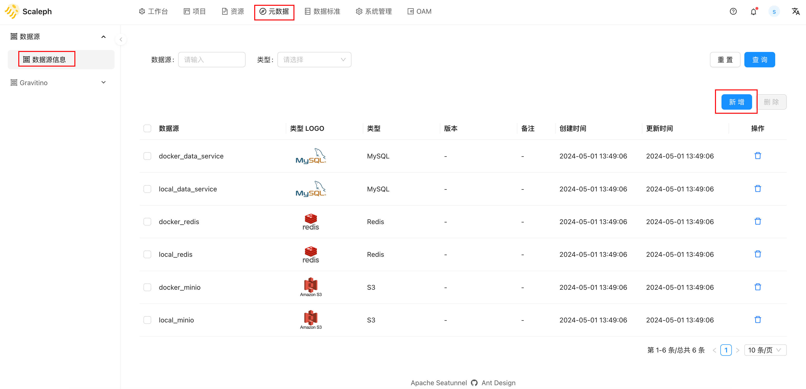

输入数据源信息：

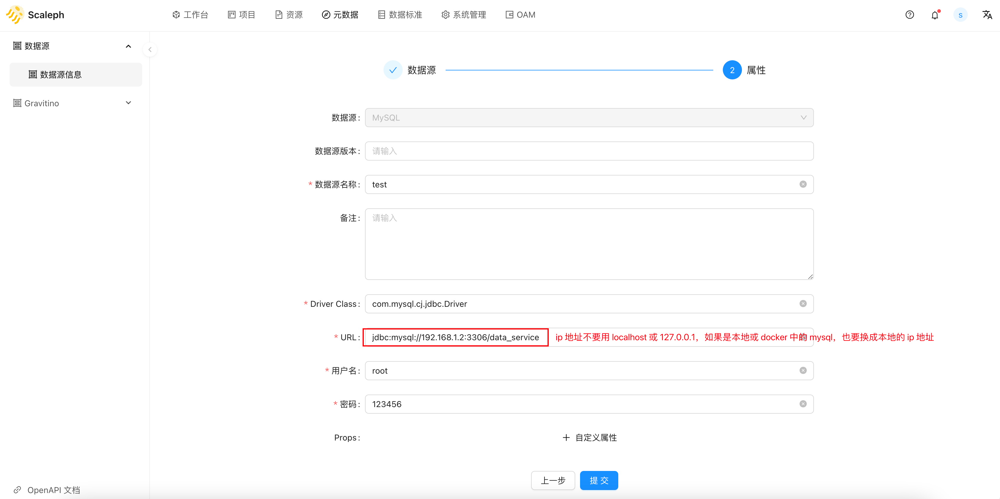

点击 `【提交】按钮`，查看数据源：

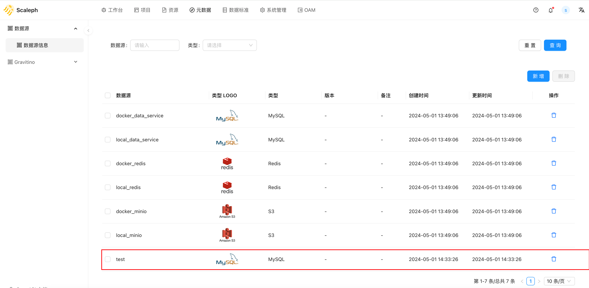

### SeaTunnel

数据源创建完成后，即可在 `项目` -> `数据集成` -> `SeaTunnel` 创建 SeaTunnel 任务：

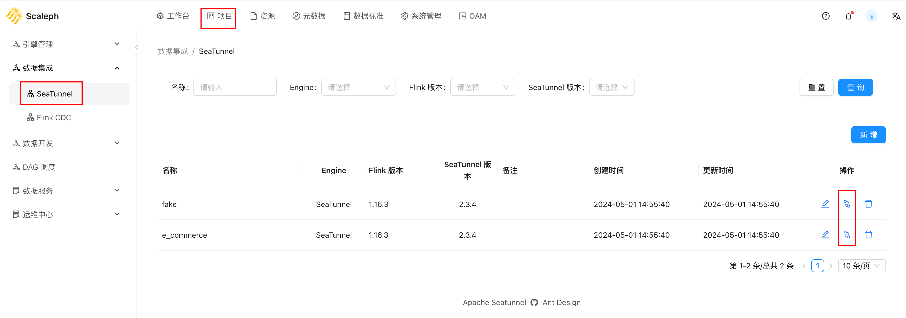

点击 `【流程定义】按钮` 即可进入 DAG 页面：

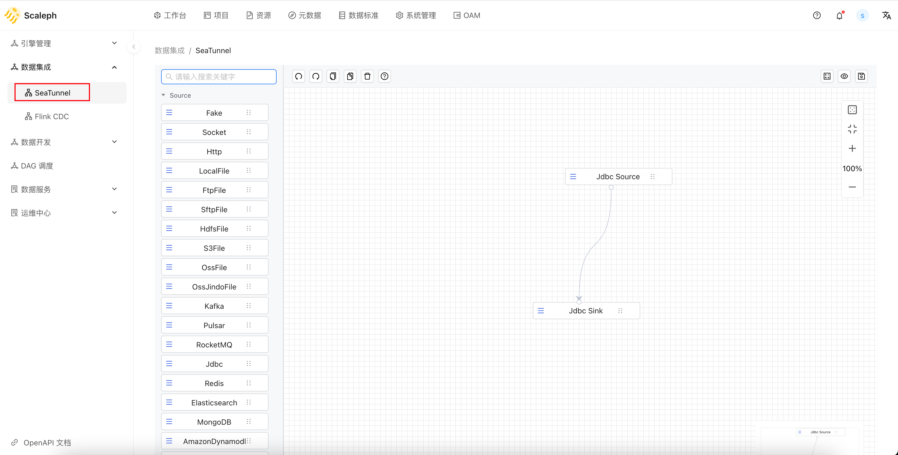

DAG 页面布局如下：

- 左侧侧边栏。connector 列表，SeaTunnel 2.3.4 支持 source、 sink 和 transform connectors，上方检索框提供 connector 搜索功能。
- 中间主体。connector DAG，拖拉拽生成 SeaTunnel 任务主体部分。
- 上方工具栏。`【保存】` 和 `【预览】`按钮。
- 右侧工具栏。缩放功能。
- 右下方小地图。

从 `左侧侧边栏` 拖过一个 connector，双击即可编辑配置：

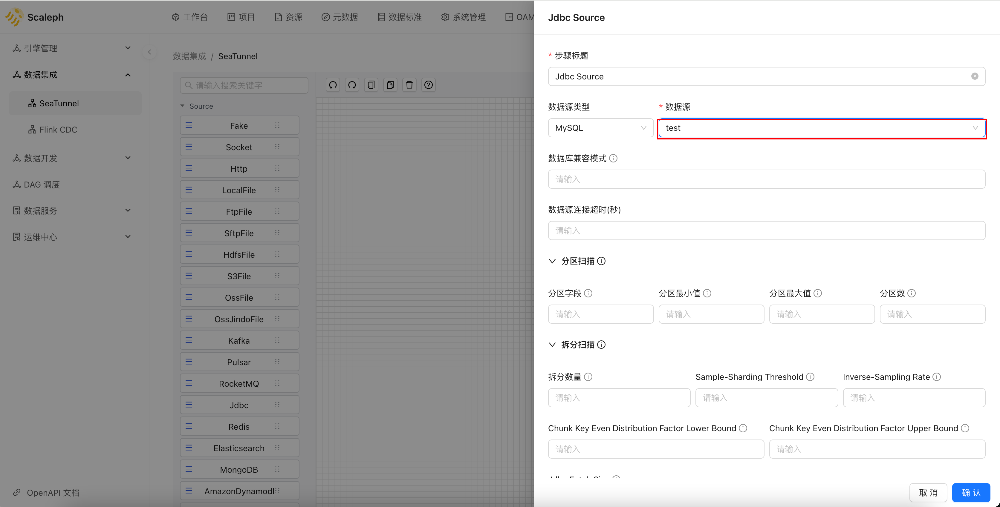

可以点击 `上方工具栏 -> 【保存】按钮和【预览】按钮` 进行配置保存和预览：

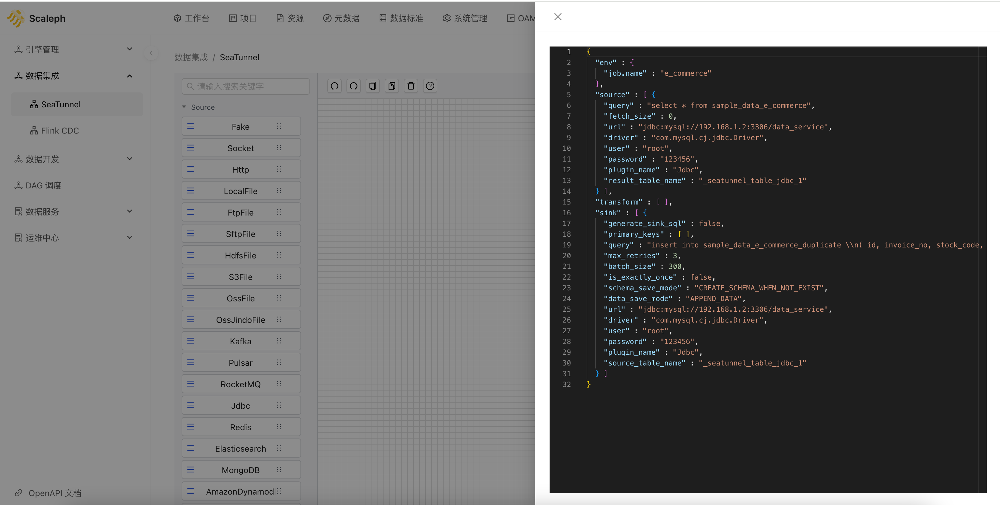

SeaTunnel 配置文件使用 [config](https://github.com/lightbend/config) 库解析，配置语法为 [HOCON](https://github.com/lightbend/config/blob/main/HOCON.md)，SeaTunnel 为进一步提高配置文件可读性做了进一步的修改，但是配置文件是与 JSON 语法完全兼容的。

config 库易于读取解析 HOCON 配置，但是不易生成。`scaleph` 使用 Jackson 生成 JSON 格式的配置文件。

用户完全可以自行复制保存 `【预览】` 功能的配置文件，保存为 xxxx.json 文件，使用 SeaTunnel 提供的 `start-seatunnel-flink-connector-v2.sh` 脚本提交、运行任务。同时在使用 `scaleph` 遇到任务无法提交、正常运行时也可采用此种方式，定位问题是 SeaTunnel 引擎还是 `scaleph` 系统。

### 部署 SeaTunnel 任务

SeaTunnel 作为新一代的数据集成引擎，同时支持 Flink、Spark 和自研 Zeta 引擎。`scaleph` 只单独支持了 Flink 引擎，将 SeaTunnel 任务作为 Flink Jar 形式的任务提交到 Kubernetes。

用户可以在 `项目` -> `运维中心` -> `Flink任务` 部署 SeaTunnel 类型任务：

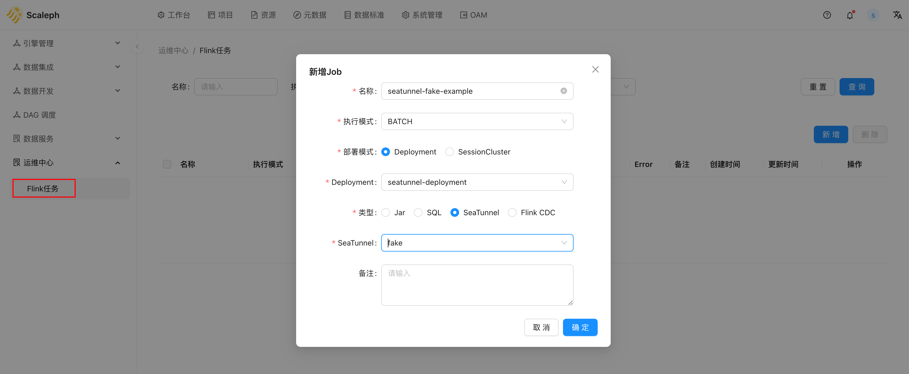

可创建 2 个 SeaTunnel 任务：

创建完成后，进入详情页，点击 `Deploy` 启动任务：：

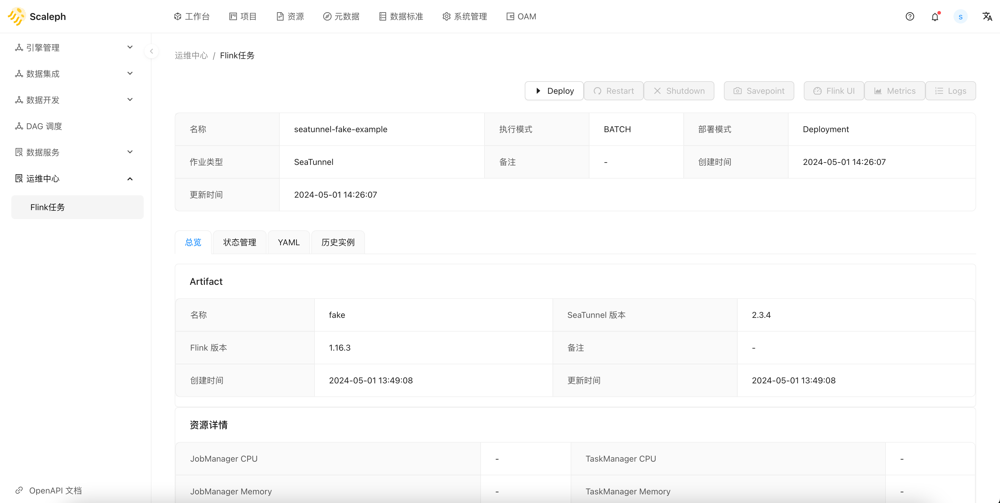

部署后，即需要等待 Flink 任务启动。

观察 Flink 任务启动日志，可以查看到 `SeaTunnel` 定义的 starter Jar 执行 任务：

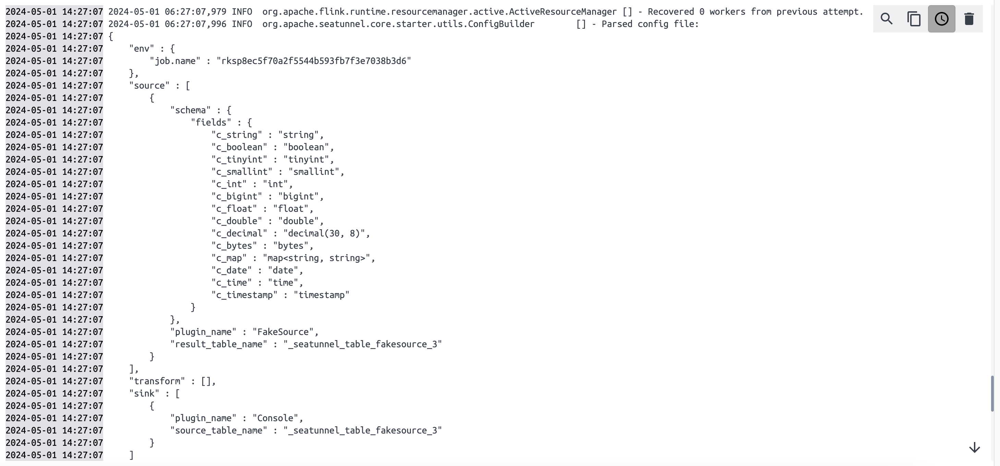

Flink 任务开始启动、运行，用户可通过 `Flink UI` 按钮获取 Flink 任务的 webui：

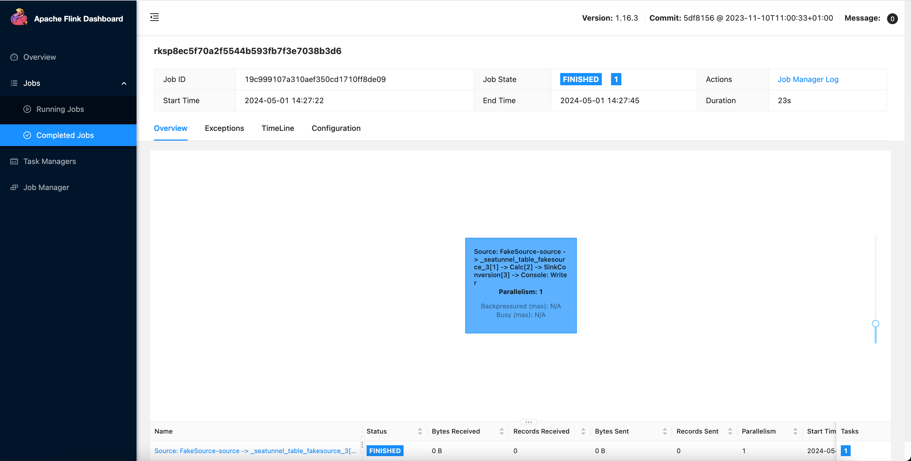

对于 Jdbc 任务，Flink 任务启动日志：

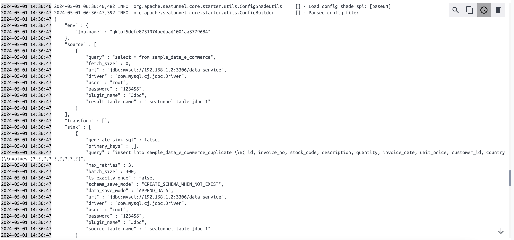

查看 MySQL，可以查看到对应的数据：

