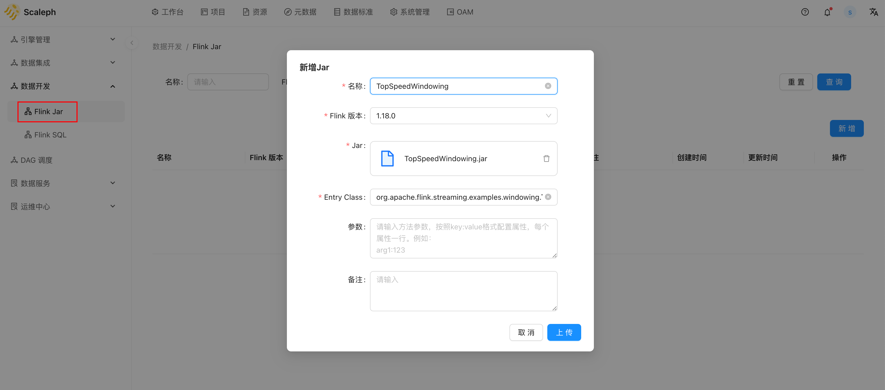
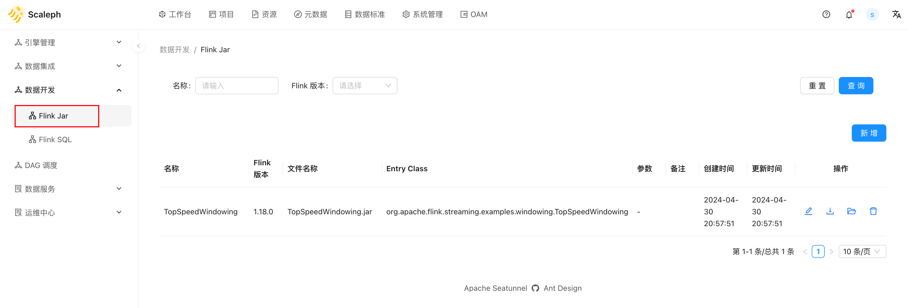
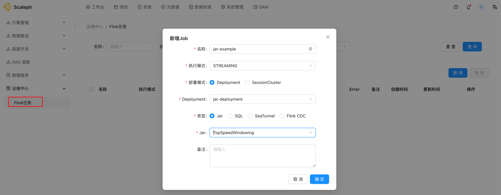
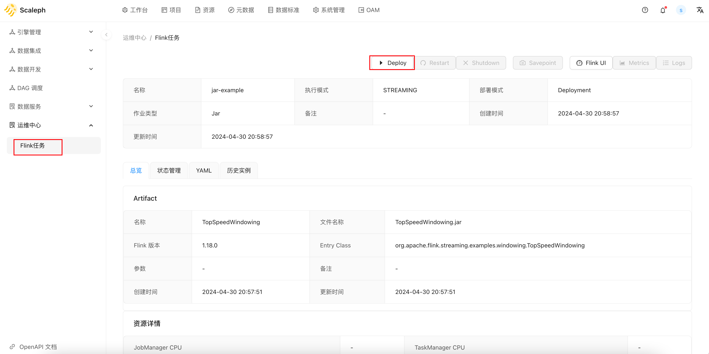
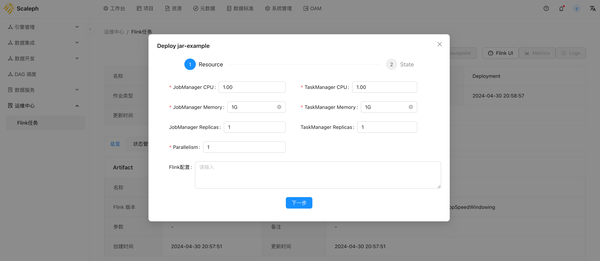
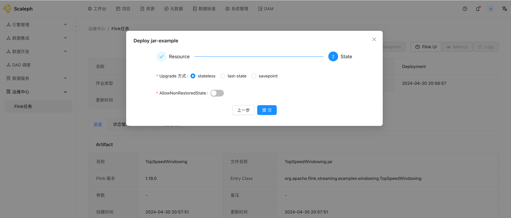
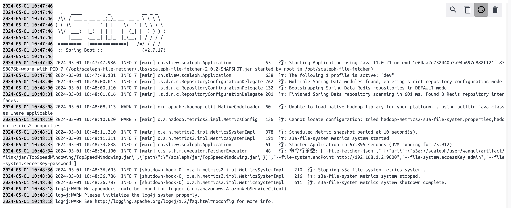
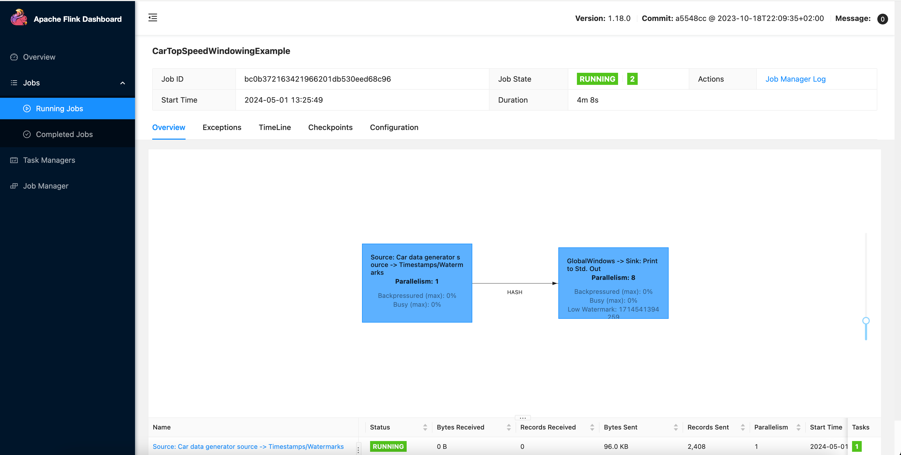
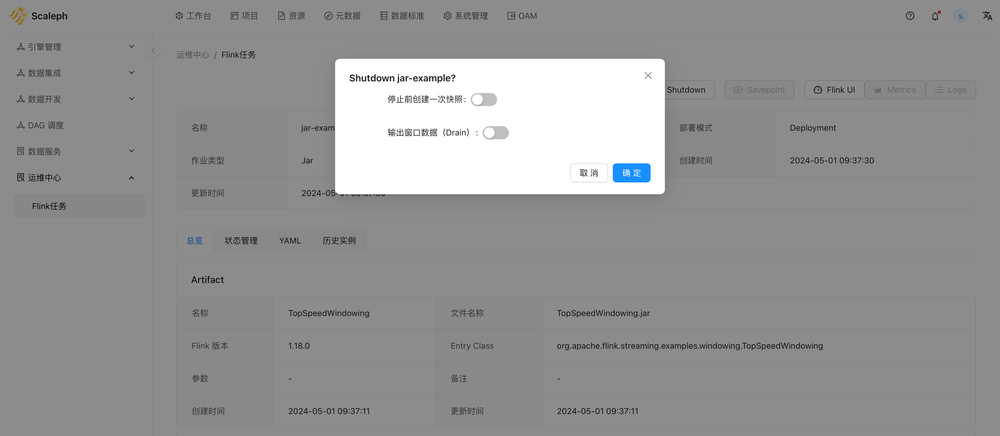

# Jar

用户使用 Flink DataStream 或 Table API 开发任务，打包成 Jar，`scaleph` 支持用户提交 Jar 包形式的 Flink 任务 。

## Artifact

首先上传 Jar artifact，操作路径为 `项目` -> `数据开发` -> `Flink Jar`。以 Flink 提供的 examples 为例：

上传完成后，效果如下：

## 启动任务

用户可以在 `项目` -> `运维中心` -> `Flink任务` 部署 Jar 类型作业：

创建完成后，进入详情页，点击 `Deploy` 启动任务：

部署后，即需要等待 Flink 任务启动。

`scaleph` 添加了一个 init-container 用于加载用户上传的 Jar 到 Flink 容器中，init-container 日志内容如下：

在 init-container 容器成功下载 Jar 到 Flink 容器中后，Flink 任务开始启动、运行，用户可通过 `Flink UI` 按钮获取 Flink 任务的 webui：

稍后用户可以点击 `Shutdown` 按钮关闭 Flink 任务：

