# SQL

`scaleph` 对接了 [SQL Gateway](https://nightlies.apache.org/flink/flink-docs-release-1.18/docs/dev/table/sql-gateway/overview/) 提供了 Flink SQL online 编辑器，用户可以在线开发、调试 Flink SQL 任务。

任务上线时，用户需在 `项目` -> `运维中心` -> `Flink任务` 部署 SQL 任务。

 [SQL Gateway](https://nightlies.apache.org/flink/flink-docs-release-1.18/docs/dev/table/sql-gateway/overview/) 不支持 Application 默认运行，因此只能支持 kubernetes-session 方式，用户在使用 Flink SQL online 编辑器前需创建一个 Session Cluster，并启用 SQL Gateway。

## 创建 Session Cluster

在 `项目` -> `引擎管理` -> `计算引擎` -> `Flink` -> `Session 集群` 点击【新建】按钮，创建 Session Cluster：

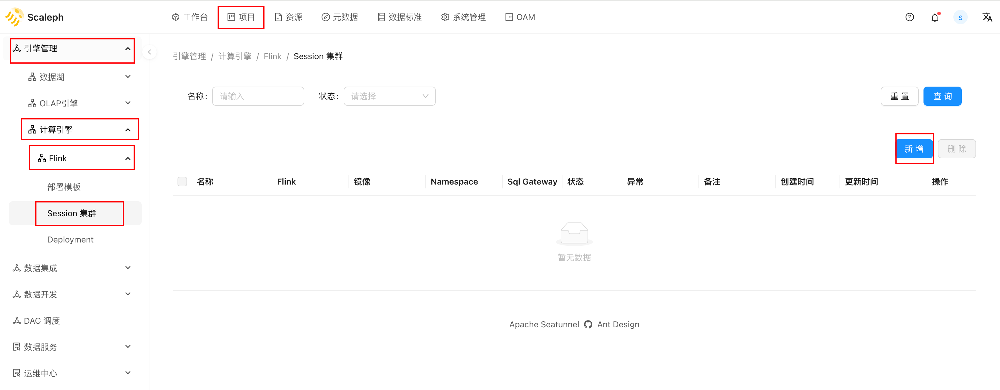

点击【新建】按钮后，进入分步表单，以此填写 `Cluster&Template`、`Options`，并在 `YAML` 查看最终的 yaml 效果：

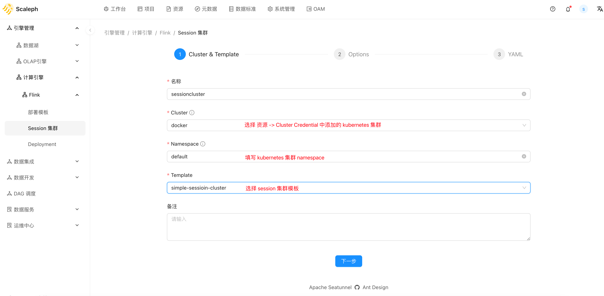

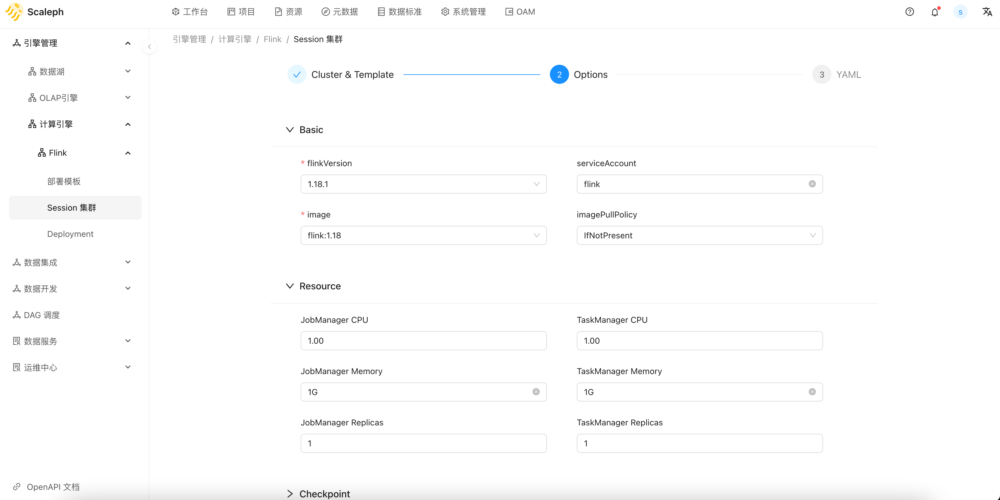

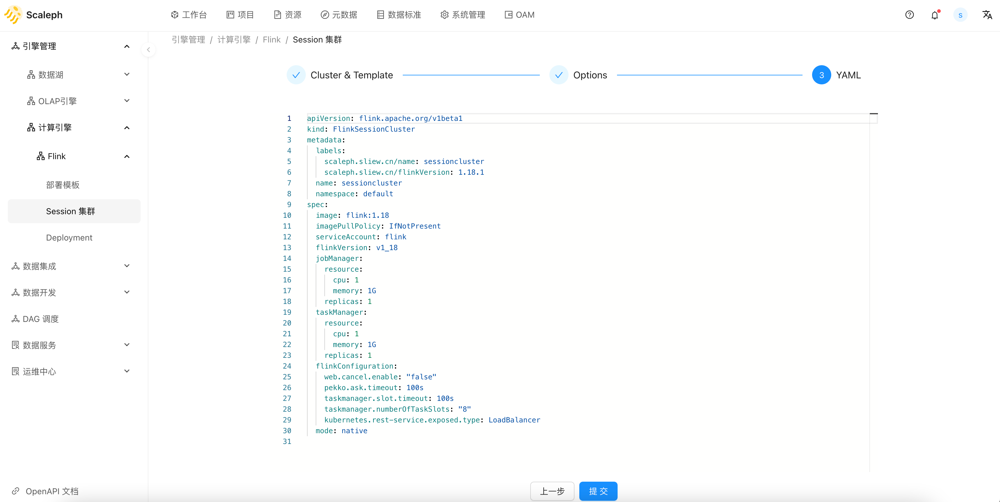

创建完成后，可以点击【启动】按钮部署 session cluster，点击【Sql Gateway】启动 SQL Gateway：

用户可以在 session cluster 详情页部署或关闭 session cluster，并查看 Flink web ui：

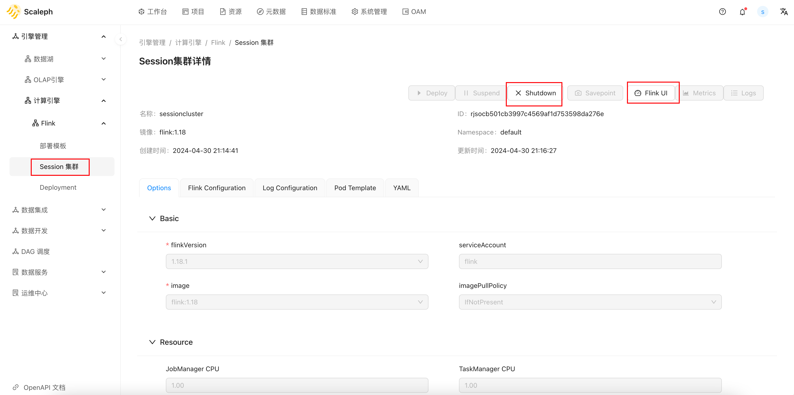

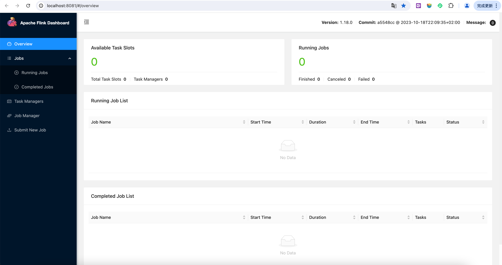

## SQL 开发

在 `项目` -> `数据开发` -> `Flink SQL` 可以进入 Flink SQL online 编辑器，在线开发 SQL 任务，Flink SQL online 编辑器增加了 Flink [Catalogs](https://nightlies.apache.org/flink/flink-docs-release-1.19/docs/dev/table/catalogs/) 支持。

挨个选中、运行 DDL 语句，创建 catalog、database 和 table：

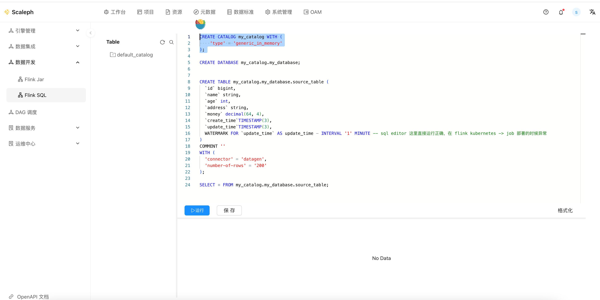

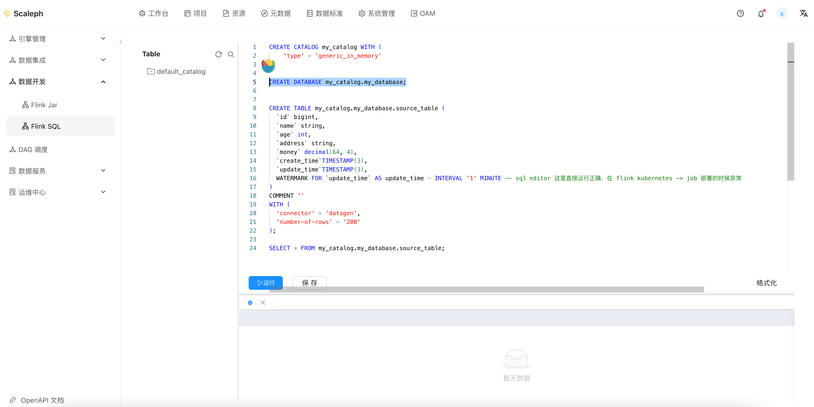

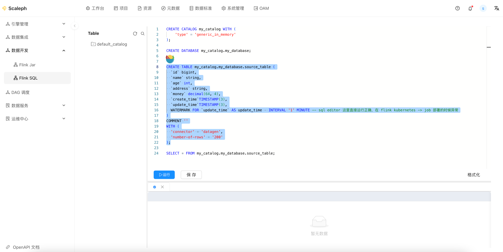

在执行过一系列 DDL 后，可以在侧边栏看到对应的 database 和 tables：

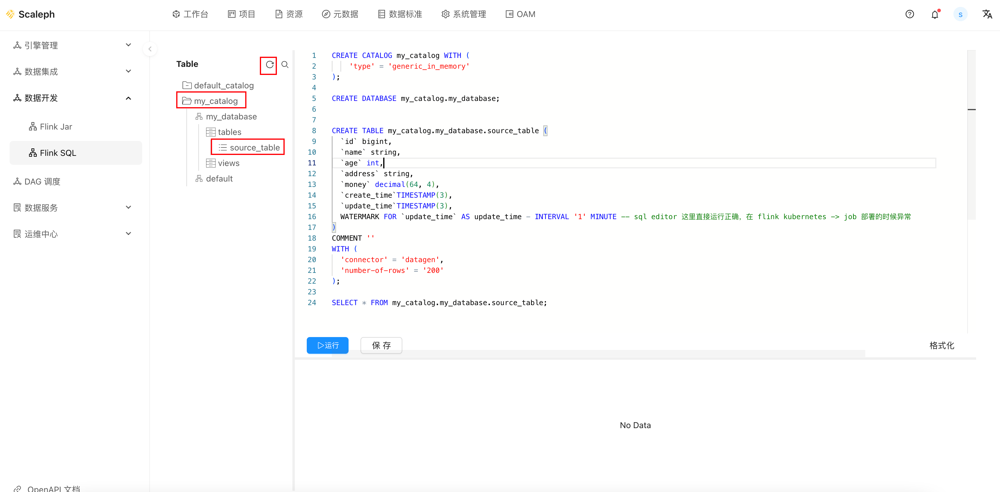

选中 select 语句，点击 `运行`，稍等片刻即可看到执行结果：

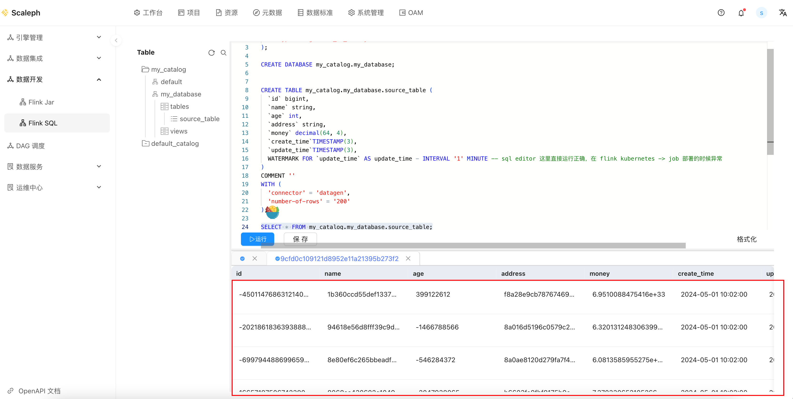

同时可以在 Flink web-ui 查看任务：

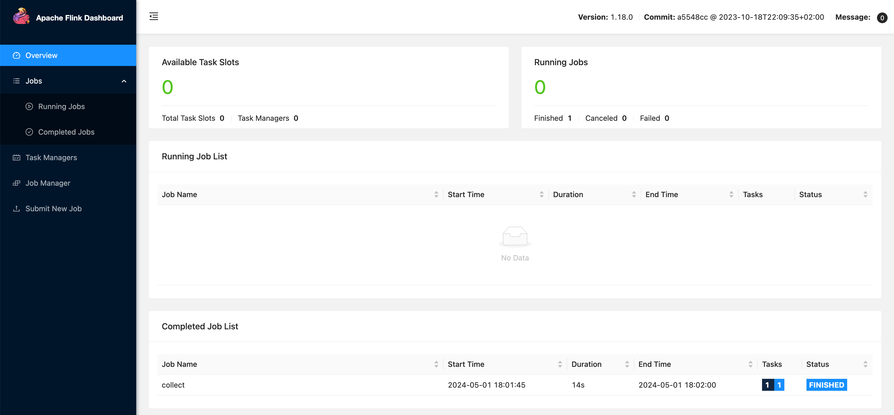

## 部署 SQL 任务

用户可以在 `项目` -> `运维中心` -> `Flink任务` 部署 SQL 类型作业：

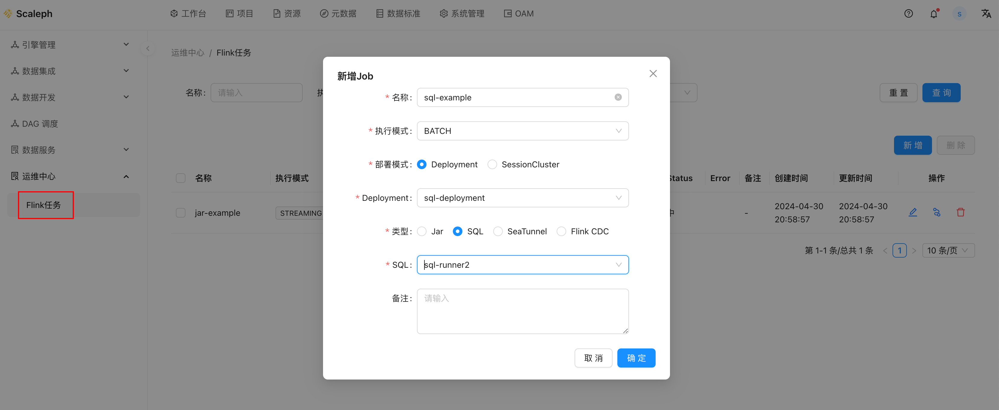

创建完成后，进入详情页，点击 `Deploy` 启动任务：

部署后，即需要等待 Flink 任务启动。

观察 Flink 任务启动日志，可以查看到 `scaleph` 定义的 sql-runner 执行 sql：

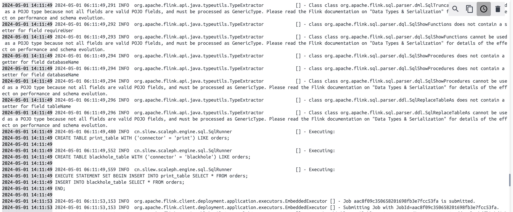

Flink 任务开始启动、运行，用户可通过 `Flink UI` 按钮获取 Flink 任务的 webui：

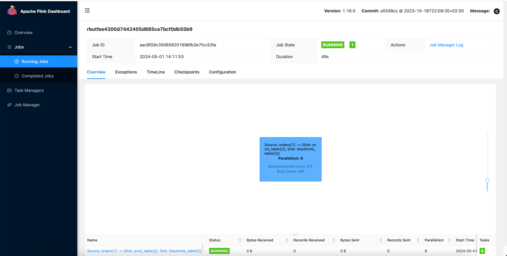
