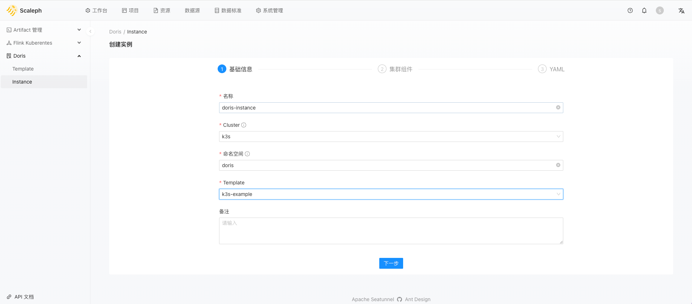
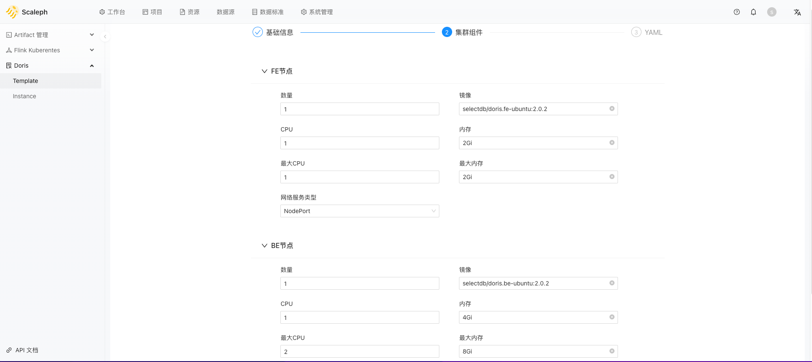
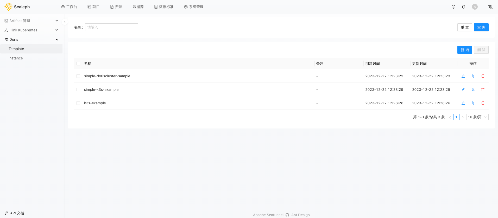
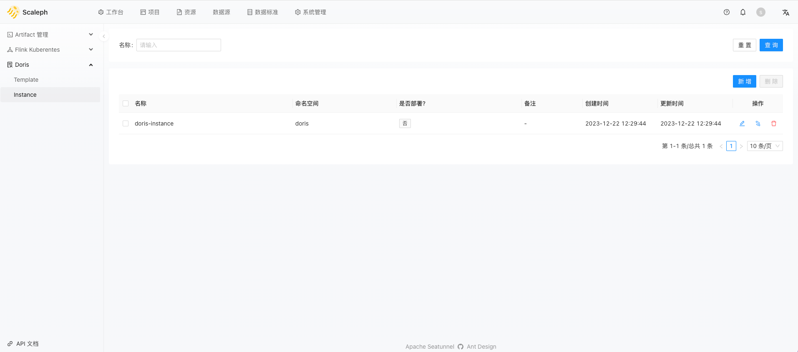
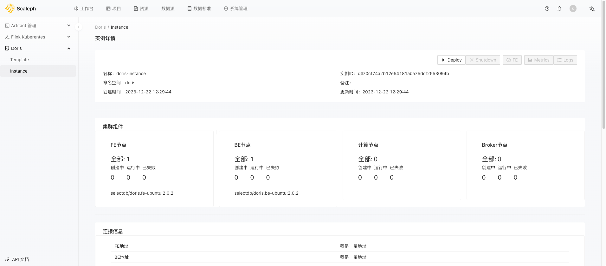
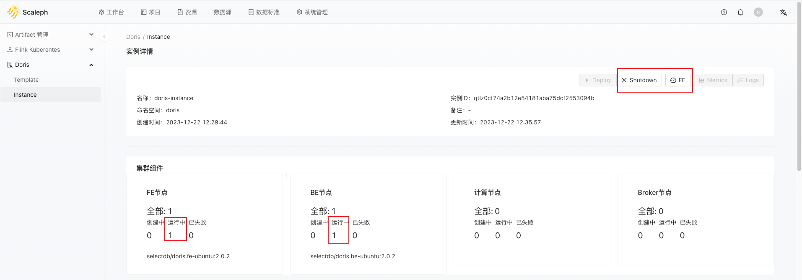
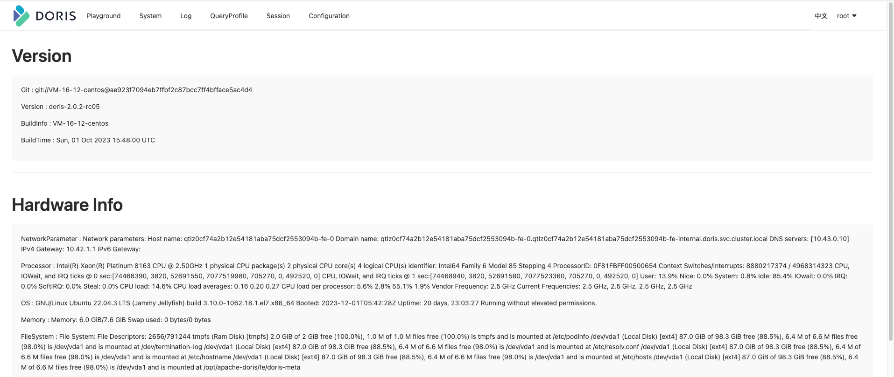
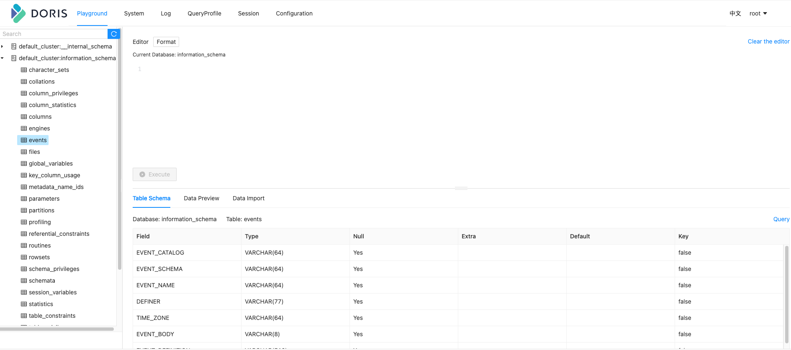

# Doris 使用指南

Doris 使用介绍

## Template

类似 Flink 相关的功能，Doris 也增加了模板，帮助用户提前预设 Doris 集群配置，减少新建集群时配置工作量。

用户可以在 `项目` -> `Doris` -> `Template` 中，创建或修改模板。

## Instance

下一步就可以创建 Doris 实例，每个实例都是一个运行在 Kubernetes 上的 Doris 集群。

用户可以在 `项目` -> `Doris` -> `Instance` 创建实例：

用户可以在实例详情页，点击 【Deploy】按钮，部署集群：

等待片刻，等待节点启动：

用户可以通过 Kubernetes 查看 Doris 集群的状态，这部分内容对于排查 Doris 异常非常有用：

## Doris

用户可以在 Doris 实例详情页的 【FE】按钮，跳转到 Doris 的 web 页：

